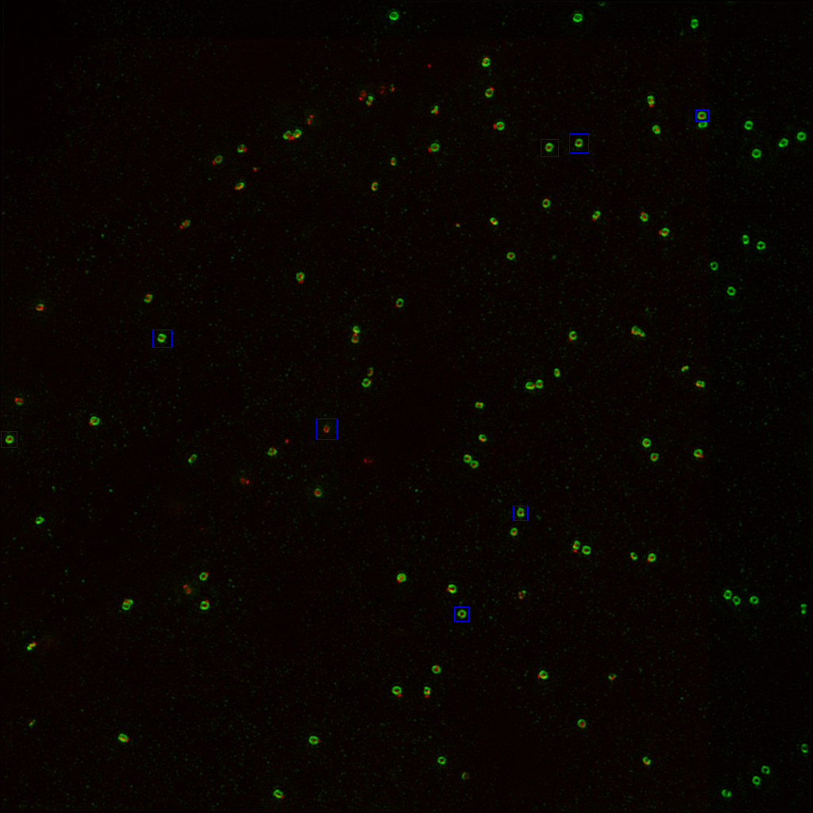
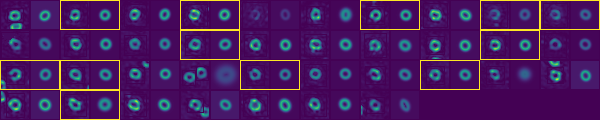
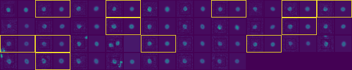

# Measure the radius of labelled centriole imaged by 3DSIM

The title is self-explanatory. We want to measure the position of different centriolar protein relative to the center of the centriole using 3DSIM. To measure, we perform Ring Gaussian Modelling on each centriole ang obtain the thickness of centriole, major, and minor axis of it. 
The image are annotated by blue bounding box (0, 0, 255) using Fiji.  
It is an example image we obtained from 3DSIM. Cep97 and Asl were labelled:  
  
(courtesy of Alan Waimann)

## Getting Started

These instructions will get you a copy of the project up and running on your local machine for development and testing purposes. It was developed in macOS Sierra Version 10.12.6 but similar logic will apply to other systems.

### Prerequisite

Please install anaconda python 2.7 version from [anaconda website](https://www.anaconda.com/download/#macos)

### Installing

Once anaconda is up and running. Please download **environment.yml** from installation folder. Place the file on the Desktop.  
Open terminal and type:
```
cd Desktop
```
Press **Enter** Then type:  
```
conda env create -f environment.yml
```
Press **Enter** Please wait patiently.  

## Running and tests
### Download the example files
From Demo folder in this repository download example1.tif to exmple5.tif. Save them on the Desktop. Create a new folder called Demo. Place Demo folder in your local machine.  
The images were taken by OMX-V3 microscope and converted to tif formate for our usage.  

Open terminal and type:  
```
cd Desktop
```

Press **Enter** Then type:  
```
git clone https://github.com/SiuShingWong/SIM-centriole-size-measurement.git
```

### Running and testing the program
Close all the terminal window. Open terminal and type:  
```
cd Desktop/SIM-centriole-size-measurement
```
Press **Enter** Then type:  
```
source activate CV
```
Press **Enter** Then type:  
```
python quantitfy_centrosome.py -d "/Users/your_user_name_of_computer/Desktop/Demo" -rn "Cep97" -gn "Asl"
```
The available arguments of the program are:  
```
python quantitfy_centrosome.py -d -rn -gn [-e] [-rmin] [-rmax] [-gmin] [-gmax] [-h]
```
Square bracket indicates it is an optional argument  
| Argument | Description |
| :--- | :---------------------------------------------------- |
| -d | the path to the folder containing all images - Required by the program |
| -rn | the name of red channel - Required by the program |
| -gn | the name of green channel - Required by the program |
| -e | eccentricity threshold - default = 1.2 |
| -rmin | lower bound of the radius in red channel - default = 0.5 |
| -rmax | upper bound of the radius in red channel - default = 2.5 |
| -gmin | lower bound of the radius in green channel - default = 3.5 |
| -gmax | upper bound of the radius in green channel - default = 4.5 |
| -h | help |
  
The program creates "Results" folder in the same directory as the images. In "Results", there are several files namely Parameters_results.txt, radius_profile.png, raw_data.csv, and summary.csv

There are two montages, each contains multiple centrioles-model pair:
  
  

### Explanation of the output
The program perform Otsu thresholding on the **first frame** of the video. The same threshold will be applied throughout every frame of the video. Any intensity above the threshold will be preserved in the binarized mask.  

The output:  
  
| Name | Description |
| :------------ | :-------------------------------------------------------------------------------------------- |
| Asl_montages.png | The montage of the green channel |
| Cep97_montages.png | The montage of the red channel |
| Parameters_results.txt | The parameters and threshold used in the program to obtain the data |
| radius_profile.png | The figure demonstration the radius measured from red and the green channel |
| raw_data.csv | with each row is the features of each centriole |
| summary.csv | calculate the mean, standard deviation, and other statistical parameters from raw_data.csv |
  
### Advanced usage and caution
- Remember to create a **Blue** bounding box for centriole that you want to measure!

### Authors
**Isaac Wong** @ Raff Lab

## Acknowledgements
- Alan Waimann for generating the data
- Everyone from Raff Lab
- Sir William Dunn School of Pathology
- Balliol College
- Clarendon Fund
- Cancer Research UK

## License
This project is licensed under GNU GENERAL PUBLIC LICENSE


